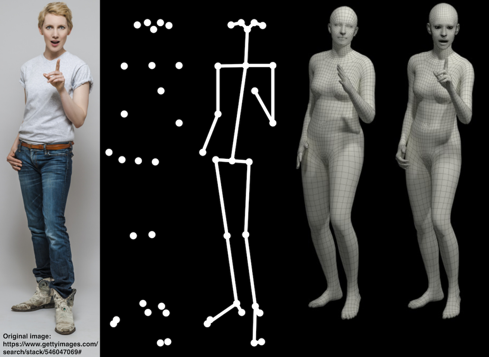

## Expressive Body Capture: 3D Hands, Face, and Body from a Single Image

[[Project Page](https://smpl-x.is.tue.mpg.de/)] 
[[Paper](https://ps.is.tuebingen.mpg.de/uploads_file/attachment/attachment/497/SMPL-X.pdf)]
[[Supp. Mat.](https://ps.is.tuebingen.mpg.de/uploads_file/attachment/attachment/498/SMPL-X-supp.pdf)]



## Table of Contents
  * [License](#license)
  * [Description](#description)
    * [Fitting](#fitting)
    * [Different Body Models](#different-body-models)
    * [Visualizing Results](#visualizing-results)
  * [Dependencies](#dependencies)
  * [Citation](#citation)
  * [Acknowledgments](#acknowledgments)
  * [Contact](#contact)


## License

Software Copyright License for **non-commercial scientific research purposes**.
Please read carefully the [terms and conditions](https://github.com/vchoutas/smplx/blob/master/LICENSE) and any accompanying documentation before you download and/or use the SMPL-X/SMPLify-X model, data and software, (the "Model & Software"), including 3D meshes, blend weights, blend shapes, textures, software, scripts, and animations. By downloading and/or using the Model & Software (including downloading, cloning, installing, and any other use of this github repository), you acknowledge that you have read these terms and conditions, understand them, and agree to be bound by them. If you do not agree with these terms and conditions, you must not download and/or use the Model & Software. Any infringement of the terms of this agreement will automatically terminate your rights under this [License](./LICENSE).

## Disclaimer

The original images used for the figures 1 and 2 of the paper can be found in [this link](https://www.gettyimages.de/search/stack/546047069#). 
The images in the paper are used under license from gettyimages.com.
We have acquired the right to use them in the publication, but redistribution is not allowed.
Please follow the instructions on the given link to acquire right of usage.
Our results are obtained on the 483 × 724 pixels resolution of the original images.

## Description

This repository contains the fitting code used for the experiments in [Expressive Body Capture: 3D Hands, Face, and Body from a Single Image](https://smpl-x.is.tue.mpg.de/).

### Fitting 
Run the following command to execute the code:
```Shell
python smplifyx/main.py --config cfg_files/fit_smplx.yaml 
    --data_folder DATA_FOLDER 
    --output_folder OUTPUT_FOLDER 
    --visualize="True/False"
    --model_folder MODEL_FOLDER
    --vposer_ckpt VPOSER_FOLDER
    --part_segm_fn smplx_parts_segm.pkl
```
where the `DATA_FOLDER` should contain two subfolders, *images*, where the
images are located, and *keypoints*, where the OpenPose output should be
stored.

### Different Body Models

To fit [SMPL](http://smpl.is.tue.mpg.de/) or [SMPL+H](http://mano.is.tue.mpg.de), replace the *yaml* configuration file 
with either *fit_smpl.yaml* or *fit_smplx.yaml*, i.e.:
 * for SMPL:
 ```Shell
 python smplifyx/main.py --config cfg_files/fit_smpl.yaml 
    --data_folder DATA_FOLDER 
    --output_folder OUTPUT_FOLDER 
    --visualize="True/False"
    --model_folder MODEL_FOLDER
    --vposer_ckpt VPOSER_FOLDER
 ```
  * for SMPL+H:
 ```Shell
 python smplifyx/main.py --config cfg_files/fit_smplh.yaml 
    --data_folder DATA_FOLDER 
    --output_folder OUTPUT_FOLDER 
    --visualize="True/False"
    --model_folder MODEL_FOLDER
    --vposer_ckpt VPOSER_FOLDER
 ```
 
### Visualizing Results

To visualize the results produced by the method you can run the following script:
```Shell
python smplifyx/render_results.py --mesh_fns OUTPUT_MESH_FOLDER
```
where *OUTPUT_MESH_FOLDER* is the folder that contains the resulting meshes.

## Dependencies

Follow the installation instructions for each of the following before using the
fitting code.

1. [PyTorch](https://pytorch.org/)
2. [SMPL-X](https://github.com/vchoutas/smplx)
3. [VPoser](https://github.com/nghorbani/HumanBodyPrior)
4. [Homogenus](https://github.com/nghorbani/homogenus)

### Optional Dependencies

1. [PyTorch Mesh self-intersection](https://github.com/vchoutas/torch-mesh-isect) for interpenetration penalty 
   * Download the per-triangle part segmentation: [smplx_parts_segm.pkl](https://owncloud.tuebingen.mpg.de/index.php/s/MWnr8Kso4K8T8at)
1. [Trimesh](https://trimsh.org/) for loading triangular meshes
1. [Pyrender](https://pyrender.readthedocs.io/) for visualization

The code has been tested with Python 3.6, CUDA 10.0, CuDNN 7.3 and PyTorch 1.0 on Ubuntu 18.04. 

## Citation

If you find this Model & Software useful in your research we would kindly ask you to cite:

```
@inproceedings{SMPL-X:2019,
  title = {Expressive Body Capture: 3D Hands, Face, and Body from a Single Image},
  author = {Pavlakos, Georgios and Choutas, Vasileios and Ghorbani, Nima and Bolkart, Timo and Osman, Ahmed A. A. and Tzionas, Dimitrios and Black, Michael J.},
  booktitle = {Proceedings IEEE Conf. on Computer Vision and Pattern Recognition (CVPR)},
  year = {2019}
}
```

## Acknowledgments

### LBFGS with Strong Wolfe Line Search

The LBFGS optimizer with Strong Wolfe Line search is taken from this [Pytorch pull request](https://github.com/pytorch/pytorch/pull/8824). Special thanks to 
[Du Phan](https://github.com/fehiepsi) for implementing this. 
We will update the repository once the pull request is merged.

## Contact
The code of this repository was implemented by [Vassilis Choutas](mailto:vassilis.choutas@tuebingen.mpg.de) and
[Georgios Pavlakos](mailto:pavlakos@seas.upenn.edu).

For questions, please contact [smplx@tue.mpg.de](mailto:smplx@tue.mpg.de). 

For commercial licensing (and all related questions for business applications), please contact [ps-licensing@tue.mpg.de](mailto:ps-licensing@tue.mpg.de).
